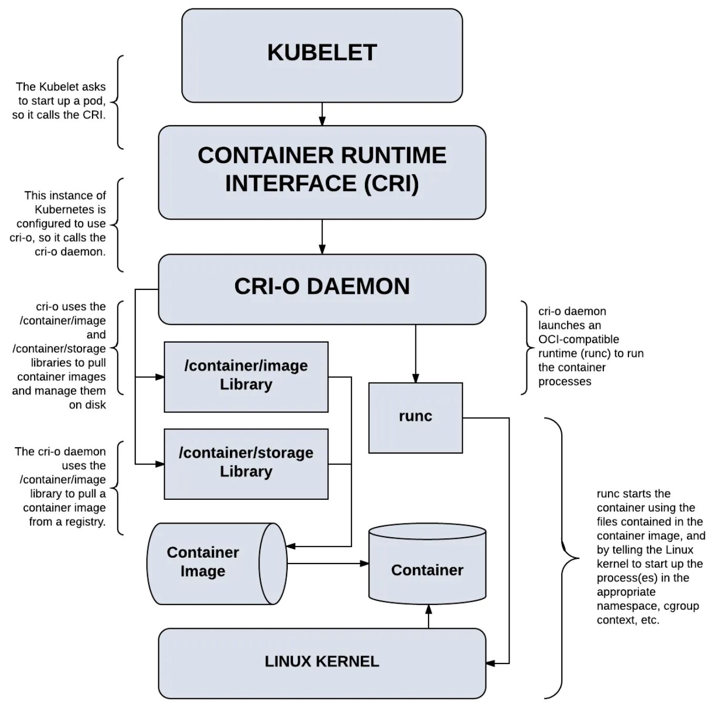

### 𝑯𝒐𝒘 𝒅𝒐𝒆𝒔 𝑪𝑹𝑰-𝑶 𝒘𝒐𝒓𝒌𝒔 𝒖𝒏𝒅𝒆𝒓 𝒕𝒉𝒆 𝒉𝒐𝒐𝒅 𝒊𝒏 𝒂 𝑲𝒖𝒃𝒆𝒓𝒏𝒆𝒕𝒆𝒔 𝒄𝒍𝒖𝒔𝒕𝒆𝒓 🤷‍♂️ 

CRI-O is a lightweight runtime container runtime for Kubernetes focussed on managing OCI compliant images and has been a prominent container runtime candidate after docker has been deprecated fully from release v1.20!

🚀 Let's understand behind the scenes of 𝐤8𝐬 <=> 𝐤𝐮𝐛𝐞𝐥𝐞𝐭 <=> 𝐂𝐑𝐈-𝐎 work-flow

✅ When a request comes to start a container, kubelet calls the CRI that invokes the internal CRI-O daemon in the linux kernel

✅ The daemon uses a compliant storage and image library on disk

✅ The CRI-O interacts with a remote registry to pull the image if not present on disk while the daemon exposes a [grpc] server with endpoints to create, start, stop (and many more other actions) on the containers.

✅ Under the hood, cri-o can use any OCI-compliant [low-level] runtimes to work with containers

✅ However the default one is runc that interacts with linux kernel 

✅ Finally it invoke processes in namespace & Cgroup context

