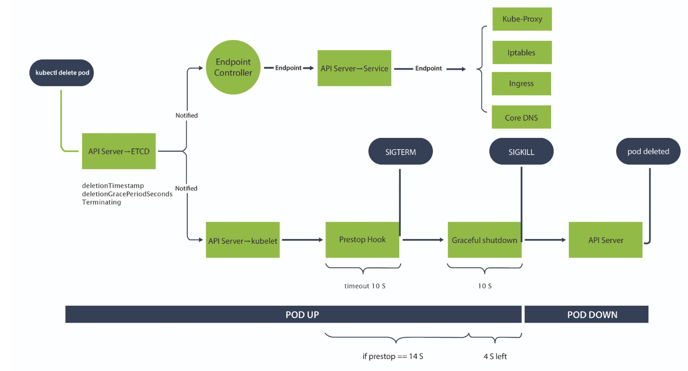

𝐖𝐡𝐚𝐭 𝐡𝐚𝐩𝐩𝐞𝐧𝐬 𝐰𝐡𝐞𝐧 𝐰𝐞 𝐝𝐞𝐥𝐞𝐭𝐞 𝐚 𝐩𝐨𝐝 𝐢𝐧 𝐊𝐮𝐛𝐞𝐫𝐧𝐞𝐭𝐞𝐬 𝐜𝐥𝐮𝐬𝐭𝐞𝐫 🤔 

Let's break it down :

- With 'kubectl delete pod' action, the pod record in ETCD will be updated by the API Server with two different fields "𝒅𝒆𝒍𝒆𝒕𝒊𝒐𝒏𝑻𝒊𝒎𝒆𝒔𝒕𝒂𝒎𝒑" and "𝒅𝒆𝒍𝒆𝒕𝒊𝒐𝒏𝑮𝒓𝒂𝒄𝒆𝑷𝒆𝒓𝒊𝒐𝒅𝑺𝒆𝒄𝒐𝒏𝒅𝒔"

- The endpoint controller checks whether pod has reached 'terminating state' 

- Once the state is reached, it removes the endpoint of the pod from the associated services to prevent external traffic

- The endpoint starts getting removed from 𝐊𝐮𝐛𝐞-𝐩𝐫𝐨𝐱𝐲, 𝐈𝐏𝐭𝐚𝐛𝐥𝐞𝐬, 𝐈𝐧𝐠𝐫𝐞𝐬𝐬, 𝐂𝐨𝐫𝐞𝐃𝐍𝐒 and all other objects that hold endpoint information

- 𝐊𝐮𝐛𝐞𝐥𝐞𝐭 is notified of the pod being updated (Terminating). 

- If the 'preStop' exists, the hook is executed, if not, the kubelet immediately sends a 𝐒𝐈𝐆𝐓𝐄𝐑𝐌 signal to the main container

- The timing of receiving the SIGTERM depends on the 𝒑𝒓𝒆𝑺𝒕𝒐𝒑 and 𝒕𝒆𝒓𝒎𝒊𝒏𝒂𝒕𝒊𝒐𝒏𝑮𝒓𝒂𝒄𝒆𝑷𝒆𝒓𝒊𝒐𝒅𝑺𝒆𝒄𝒐𝒏𝒅𝒔

- After waiting for a graceful shutdown period, which is determined by the terminationGracePeriodSeconds (default ~ 30 seconds), the container is forcibly stopped through 𝐒𝐈𝐆𝐊𝐈𝐋𝐋 action

- Finally, the API Server removes the pod from ETCD completely, updating DB

Refer:- https://lnkd.in/gEu8Qz6d
