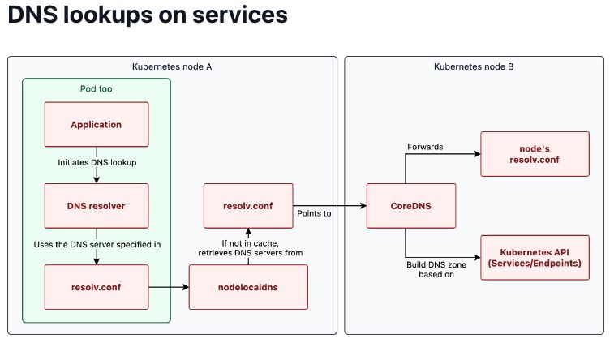

## How does a DNS query works for a Pod in Kubernetes

Let's break the basics 🚨
- 𝘞𝘩𝘦𝘯 𝘢 𝘱𝘰𝘥 𝘱𝘦𝘳𝘧𝘰𝘳𝘮𝘴 𝘢 𝘋𝘕𝘚 𝘭𝘰𝘰𝘬𝘶𝘱, 𝘵𝘩𝘦 𝘲𝘶𝘦𝘳𝘺 𝘪𝘴 𝘧𝘪𝘳𝘴𝘵 𝘴𝘦𝘯𝘵 𝘵𝘰 𝘵𝘩𝘦 𝘭𝘰𝘤𝘢𝘭 𝘋𝘕𝘚 𝘳𝘦𝘴𝘰𝘭𝘷𝘦𝘳 𝘪𝘯 𝘵𝘩𝘦 𝘱𝘰𝘥
- 𝘛𝘩𝘪𝘴 𝘳𝘦𝘴𝘰𝘭𝘷𝘦𝘳 𝘶𝘴𝘦𝘴 𝘵𝘩𝘦 𝘳𝘦𝘴𝘰𝘭𝘷.𝘤𝘰𝘯𝘧 𝘤𝘰𝘯𝘧𝘪𝘨𝘶𝘳𝘢𝘵𝘪𝘰𝘯 𝘧𝘪𝘭𝘦 𝘸𝘩𝘦𝘳𝘦 𝘵𝘩𝘦 "𝘯𝘰𝘥𝘦𝘭𝘰𝘤𝘢𝘭𝘥𝘯𝘴" 𝘴𝘦𝘳𝘷𝘦𝘳 𝘪𝘴 𝘴𝘦𝘵 𝘶𝘱 𝘢𝘴 𝘵𝘩𝘦 𝘥𝘦𝘧𝘢𝘶𝘭𝘵 𝘳𝘦𝘤𝘶𝘳𝘴𝘪𝘷𝘦 𝘋𝘕𝘚 𝘳𝘦𝘴𝘰𝘭𝘷𝘦𝘳, 𝘸𝘩𝘪𝘤𝘩 𝘢𝘤𝘵𝘴 𝘢𝘴 𝘢 𝘤𝘢𝘤𝘩𝘦.
- 𝘋𝘕𝘚 𝘴𝘦𝘳𝘷𝘦𝘳 𝘥𝘦𝘵𝘦𝘳𝘮𝘪𝘯𝘦𝘴 𝘵𝘩𝘦 𝘐𝘗 𝘢𝘥𝘥𝘳𝘦𝘴𝘴 𝘣𝘺 𝘤𝘰𝘯𝘴𝘶𝘭𝘵𝘪𝘯𝘨 𝘵𝘩𝘦 𝘒𝘶𝘣𝘦𝘳𝘯𝘦𝘵𝘦𝘴 𝘴𝘦𝘳𝘷𝘪𝘤𝘦 𝘳𝘦𝘨𝘪𝘴𝘵𝘳𝘺
- 𝘛𝘩𝘪𝘴 𝘳𝘦𝘨𝘪𝘴𝘵𝘳𝘺 𝘤𝘰𝘯𝘵𝘢𝘪𝘯𝘴 𝘢 𝘮𝘢𝘱𝘱𝘪𝘯𝘨 𝘰𝘧 𝘴𝘦𝘳𝘷𝘪𝘤𝘦 𝘯𝘢𝘮𝘦𝘴 𝘵𝘰 𝘵𝘩𝘦𝘪𝘳 𝘤𝘰𝘳𝘳𝘦𝘴𝘱𝘰𝘯𝘥𝘪𝘯𝘨 𝘐𝘗 𝘢𝘥𝘥𝘳𝘦𝘴𝘴𝘦𝘴 𝘢𝘭𝘭𝘰𝘸𝘪𝘯𝘨 𝘵𝘩𝘦 𝘤𝘭𝘶𝘴𝘵𝘦𝘳 𝘋𝘕𝘚 𝘴𝘦𝘳𝘷𝘦𝘳 𝘵𝘰 𝘳𝘦𝘵𝘶𝘳𝘯 𝘵𝘩𝘦 𝘤𝘰𝘳𝘳𝘦𝘤𝘵 𝘐𝘗 𝘢𝘥𝘥𝘳𝘦𝘴𝘴 𝘵𝘰 𝘵𝘩𝘦 𝘳𝘦𝘲𝘶𝘦𝘴𝘵𝘪𝘯𝘨 𝘱𝘰𝘥
- 𝘞𝘩𝘦𝘯 𝘢 𝘴𝘦𝘳𝘷𝘪𝘤𝘦 𝘪𝘴 𝘤𝘳𝘦𝘢𝘵𝘦𝘥 𝘪𝘯 𝘒𝘶𝘣𝘦𝘳𝘯𝘦𝘵𝘦𝘴, 𝘵𝘩𝘦 𝘤𝘭𝘶𝘴𝘵𝘦𝘳 𝘋𝘕𝘚 𝘴𝘦𝘳𝘷𝘦𝘳 𝘤𝘳𝘦𝘢𝘵𝘦𝘴 𝘢𝘯 '𝘈 𝘳𝘦𝘤𝘰𝘳𝘥' 𝘧𝘰𝘳 𝘵𝘩𝘦 𝘴𝘦𝘳𝘷𝘪𝘤𝘦
- 𝘛𝘩𝘪𝘴 𝘳𝘦𝘤𝘰𝘳𝘥 𝘮𝘢𝘱𝘴 𝘵𝘩𝘦 𝘴𝘦𝘳𝘷𝘪𝘤𝘦'𝘴 𝘋𝘕𝘚 𝘯𝘢𝘮𝘦 𝘵𝘰 𝘪𝘵𝘴 𝘐𝘗 𝘢𝘥𝘥𝘳𝘦𝘴𝘴 𝘢𝘭𝘭𝘰𝘸𝘪𝘯𝘨 𝘱𝘰𝘥𝘴 𝘵𝘰 𝘢𝘤𝘤𝘦𝘴𝘴 𝘵𝘩𝘦 𝘴𝘦𝘳𝘷𝘪𝘤𝘦 𝘶𝘴𝘪𝘯𝘨 𝘪𝘵𝘴 𝘋𝘕𝘚 𝘯𝘢𝘮𝘦.

