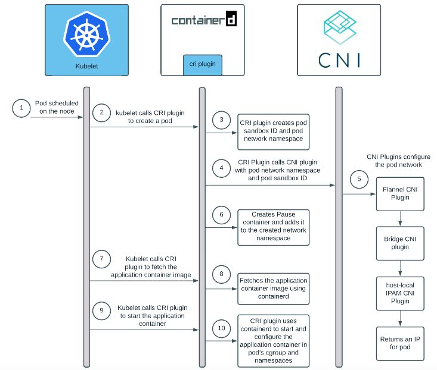

𝑲𝒖𝒃𝒆𝒍𝒆𝒕, 𝑪𝒐𝒏𝒕𝒂𝒊𝒏𝒆𝒓 𝑹𝒖𝒏𝒕𝒊𝒎𝒆 𝒂𝒏𝒅 𝑪𝑵𝑰 𝑷𝒍𝒖𝒈𝒊𝒏𝒔 - 𝒉𝒐𝒘 𝒕𝒉𝒆𝒚 𝒂𝒍𝒍 𝒔𝒕𝒊𝒕𝒄𝒉𝒆𝒅 𝒕𝒐𝒈𝒆𝒕𝒉𝒆𝒓 🤔 ☸ 

hashtag#Kubernetes uses hashtag#containerd as one of the CRI plugin to manage the full hashtag#container lifecycle, importing OCI compliant images while the networking within hashtag#pod is taken care by the hashtag#k8s hashtag#CNI plugin 
Let's understand what happens behind a pod creation :-
✅ Kubelet calls the cri plugin, via the CRI runtime service API, to create a pod
✅ CRI uses containerd internal to create and start a special pause container (the sandbox container) and put that container inside the pod’s cgroups and namespace 
✅ CRI configures the pod’s network namespace using CNI
✅ Kubelet subsequently calls the cri plugin, via the CRI image service API, to pull the application container image
✅ CRI further uses containerd to pull the image if the image is not present on the node.
✅ Kubelet then calls cri, via the CRI runtime service API, to create and start the application container inside the pod using the pulled container image
✅ CRI finally uses containerd internal to create the application container, puts it inside the pod’s cgroups and namespace, then to start the pod’s new application container. 
✅ After these steps, a pod and its corresponding application container is created and running.

Ref - https://github.com/containerd/cri/blob/v1.11.1/docs/architecture.md

